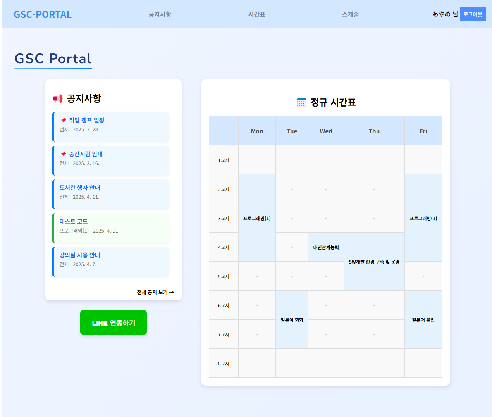
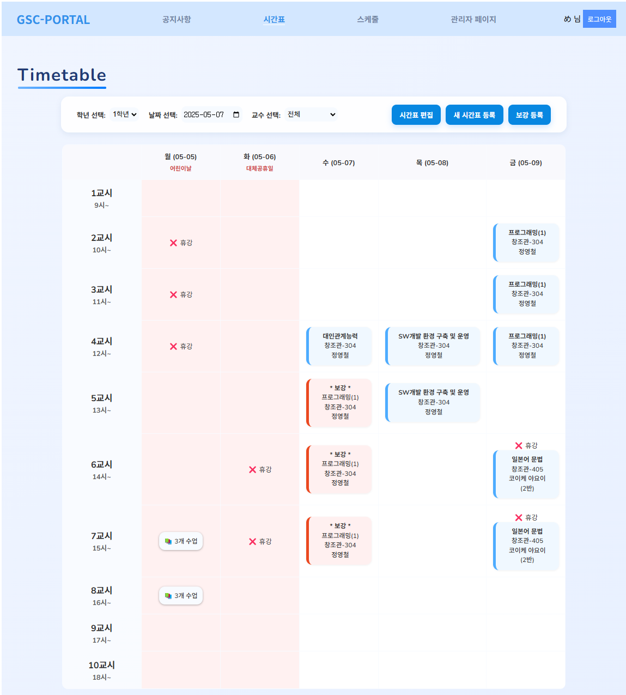
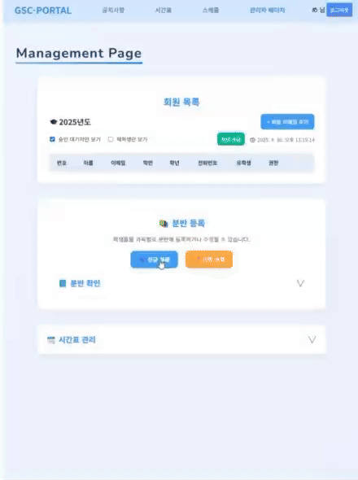
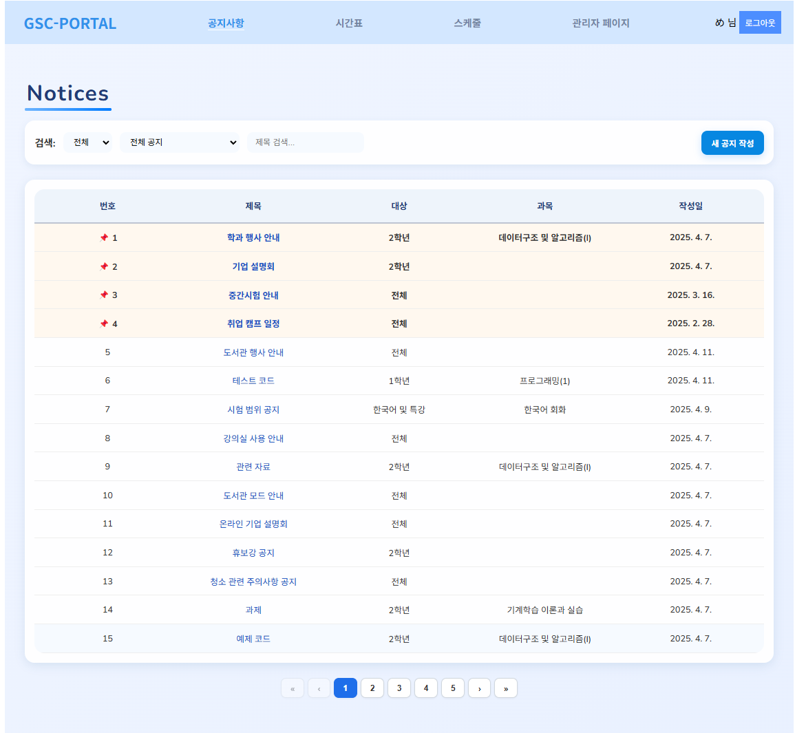
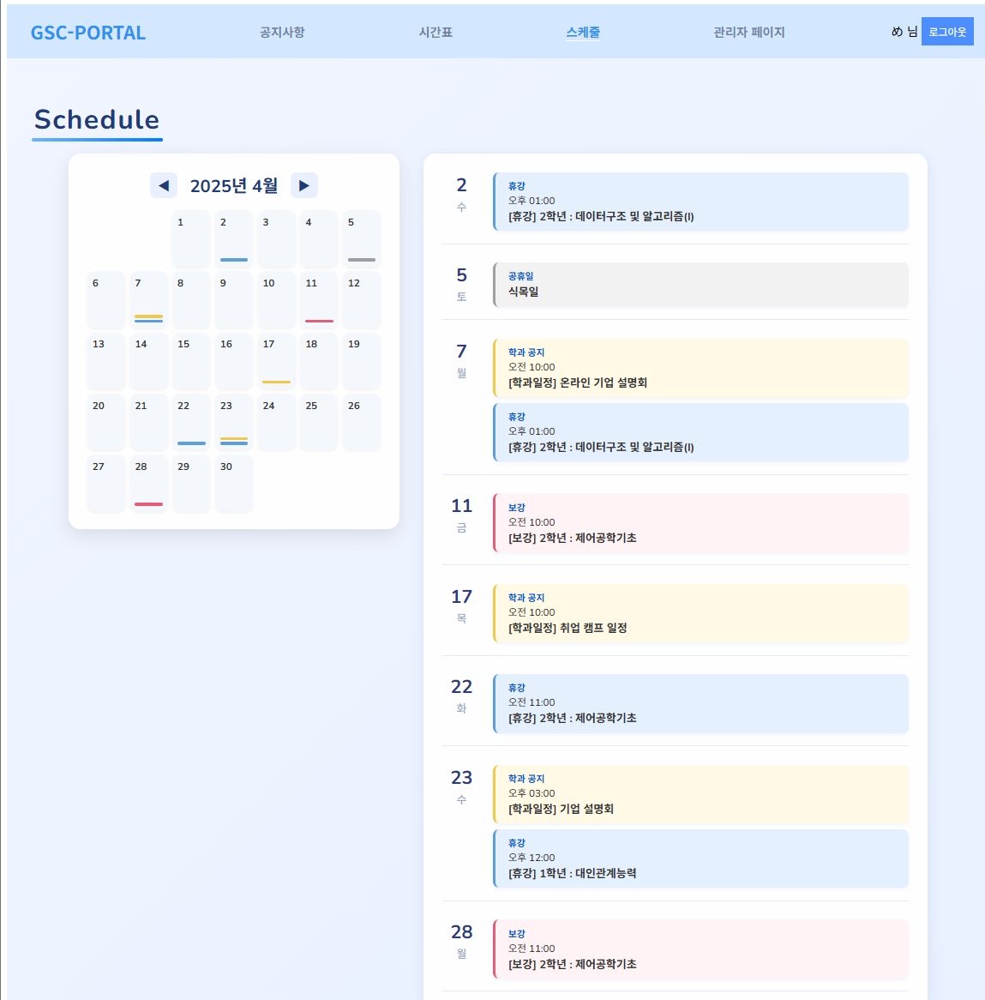

このプロジェクトの README は日本語と韓国語で提供いたします。
<br>
이 프로젝트의 README는 한국어와 일본어로 제공됩니다.

- [日本語 (Japanese)](README_jp.md)
- [한국어 (Korean)](README.md)


# 학과 포털 웹서비스

> Vue 3 + Express + MySQL 기반의 **대학 학과 운영 시스템**  
> Google Calendar 연동, LINE 알림, Drag & Drop 등 최신 웹 기능을 활용한 **실무형 통합 플랫폼**

---

## 🗂️ 개요 (Overview)

GSC 학과 포털은 **학생, 교수, 관리자**의 역할에 따라 학사 일정을 통합 관리할 수 있는 플랫폼입니다.  
**Vue 3**와 **Express.js**, **MySQL**을 기반으로 구성되어 있으며,  
**Google OAuth**, **JWT 인증**, **LINE 알림 시스템**, **Google Calendar API**,  
**Drag & Drop UI** 등의 기능을 활용하여 **확장성**과 **실무 적용성**을 고려해 설계하였습니다.

---

## 기술 스택 (Tech Stack)

| 구분        | 기술                                                             |
|-------------|------------------------------------------------------------------|
| **Frontend** | Vue 3 + Vite, Pinia, Vue Router, Axios                           |
| **Backend**  | Express.js, MySQL, JWT 인증, dotenv              |
| **외부 연동** | Google Calendar API, LINE Messaging API, 정부24 공휴일 API      |
| **인증 방식** | Google OAuth2.0 + JWT 토큰 + Refresh Token 쿠키 관리            |
| **배포 환경** |미정                                                             |

---

## 주요 기능 요약 (Main Features)

### 🔐 로그인 & 인증
- Google OAuth 로그인  
- Refresh Token 기반 자동 로그인 복원  
- 관리자 / 교수 / 학생 기능 분리
-  **등록된 학교 이메일(@g.yju.ac.kr) 또는 사전에 승인된 Gmail만 로그인 허용**
-  **관리자 승인 후 시스템 접근 가능**
 

### 📅 시간표 관리
- 학년별 정규 시간표 등록/수정  
- 보강, 휴강시각적 구분
- 학생별 분반 및 특강 필터링  
- 주간 단위 필터링 + 공휴일 자동 반영
- 교수별 필터링  
- 수업 겹침 시 `+n` 표시 및 상세 모달 제공
 

### 🎯 레벨 수업 분반 시스템
- 유학생 전용 필터링 (grade 4 대상)  
- 그룹 기반 과목-학생 연결 (group_id 기준)  
- Drag & Drop UI로 배정  
- 기존 그룹 수정 기능 지원


### 📢 공지사항 관리
- 공지 작성 / 수정 / 삭제
- 일반공지, 중요공지(상위 고정), 학과공지(Google Calendar 반영)  
- LINE 메시지 전송 옵션 포함  
- 학년별, 과목별, 키워드 필터링
- 내용 복사 기능 지원
 

### 📆 학사 일정 통합 스케줄
- Google Calendar API 연동
- **출력 대상 항목**
  - 보강 일정
  - 휴강 일정
  - 공휴일 정보 : Google 공휴일 API 기반 자동 반영
  - 학과 일정 : 공지사항 작성 시 등록한 날짜 기반 이벤트 출력  
- 일정 종류별 색상 표시  



---

## ⚙️ 프로젝트 구조 (Project Structure)
```
vue-project/
├── backend/              # Express 서버
│   ├── controllers/      # 기능별 로직
│   ├── routes/           # API 엔드포인트
│   ├── models/           # 데이터베이스 쿼리 모듈 (직접 SQL 사용, ORM 미사용)
│   ├── middleware/       # 인증 처리
│   └── utils/            # LINE, GoogleCalendar, 정부 공휴일 API 유틸
│ 
├── src/                  # Vue 프론트엔드
│   ├── App.vue           # 루트 컴포넌트 (라우팅 분기, 레이아웃 정의)
│   ├── main.js           # 앱 진입점 (라우터/Pinia 초기화)
│   ├── pages/            # 실제 라우팅되는 페이지
│   ├── components/       # UI 컴포넌트
│   ├── stores/           # Pinia 상태 관리
│   ├── router/           # Vue Router 설정
│   └── services/         # API 요청 유틸
```
---
